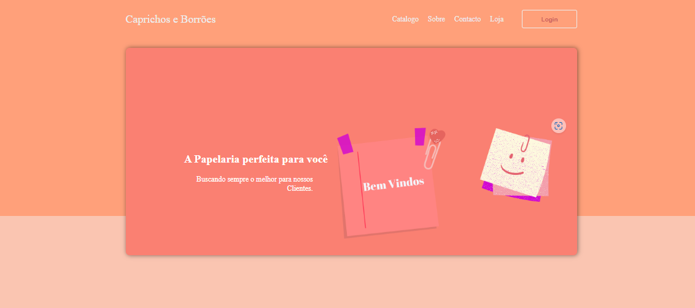
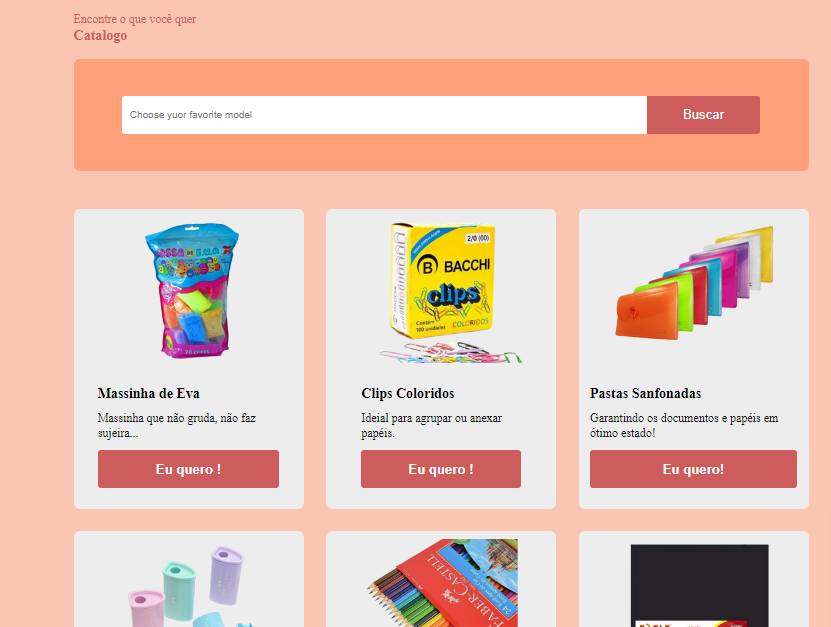
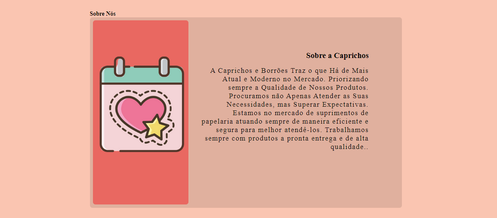
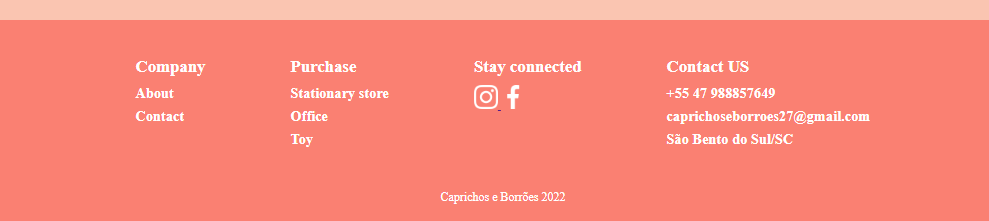

#### Projeto vitrine de loja Online
#### Esse Desafio elaborei para minha papelaria online
#### Desde de 2019 trabalho com loja online, atualmente vendendo pela plataforma shopee e buscando aprender sempre mais consegui colocar uma vitrine para minha papelaria, um sonho realizado.
#### Estou muito satisfeita com o resulatado desse projeto.

<a href="https://agostinhomarcia.github.io/papelaria-caprichos/" target="_blank" > Papelaria Caprichos</a>

[]
 

[]
 
[]
 
[]

### Tecnologias utilizadas

  
  

   
   

[ ]
